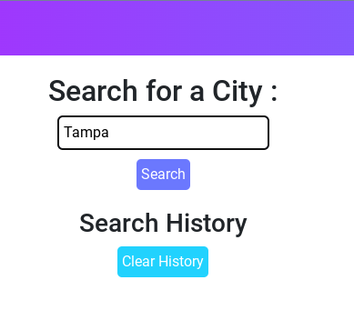
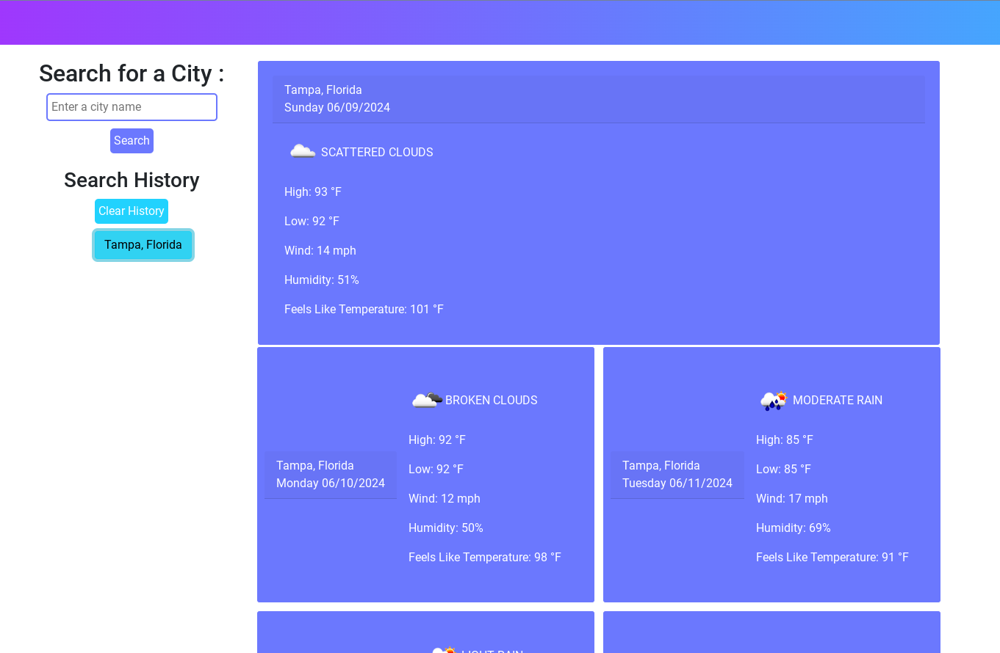

# Weather App

## Overview

The Weather App is a simple web application that allows users to search for the current weather and forecast for various cities. It displays the weather information in a user-friendly dashboard and maintains a history of searched cities.

## Features

Search for current weather and 5-day forecast by city name.

<figure>
    <figcaption>Weather App Landing Page</figcaption>
    
  </figure>
Display weather details including temperature, wind speed, humidity, and weather conditions.
<figure>
    <figcaption>Weather App Search</figcaption>
    
  </figure>
Store search history in local storage for quick access.
Clear search history functionality.

## Technologies Used

HTML

CSS

JavaScript (ES6)

jQuery

Bootstrap

Day.js

OpenWeather API

## Prerequisites

A web browser (Google Chrome, Mozilla Firefox, etc.)
An internet connection

## Usage

Open the application in your web browser: https://khardigree.github.io/weatherapp/.

Enter the name of a city in the search bar and click the "Search" button.

View the current weather and 5-day forecast for the entered city.

The searched cities will be stored in the search history. Click on a city in the history to view its weather again.

To clear the search history, click the "Clear History" button.

## License

This project is licensed under the MIT License. See the LICENSE file for details.
